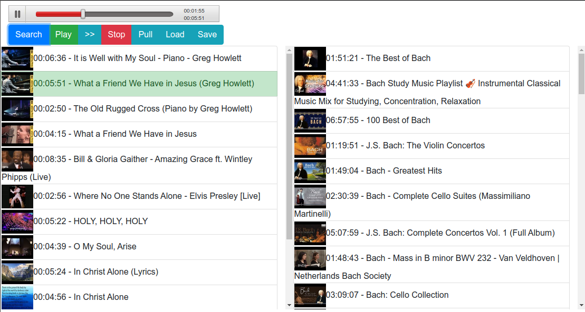

# Youtube Audio Player with web interface

Youtube audio player with web-based interface.  The player can stream audion from Youtube to any audio sink using gstreamer.
For convenience it includes simple embedded audioplayer. Current track could be rewind to any position using position tracker.
Player interface supports multiple connections. However there is no user/session support so all connections will share the same session with the same playlist.

[](MainScreen.png  "Main Screen")

On the left panel of main window is a current playlist. On the right panel are search results. Tracks can be moved by mouse between playlist and search result or rearranged. Playlist can be saved/loaded. Most of the elements support context menu called by mouse right click. Left panel is shared beween all connected clients. 

In the main window pressing to '>>' button will switch to the next track in playlist. Left Doubleclick on any track in the playlist panel will start playing from that track.
In the search window pressing to '<<' or '>>' buttons will load previous or next page of searching results into serach results panel.

For streaming to network audio sink could stream data to [icecast](https://icecast.org/ "icecast"). However, because each Youtube track is streamed as a separate stream, streamint to icecast server will stop between tracks. APM player will stop with error is incoming audio stream will finish. To prevent this you can use ether fallback-mount option on icecast, or stream data to [LiquidSoap Audio server](https://www.liquidsoap.info/ "LiquidSoap Audio server"), which will mix a permanent network stream and send it to icecast.

Player supports playlists, searh on YouTube. Player can pull Youtube playlist and store tracks in a local playlist. 
For searching on Youtube the player requiers [Youtube API Key](https://blog.hubspot.com/website/how-to-get-youtube-api-key "Youtube API Key").

Playlists are stored in a simple text format: Youtube_trackID Length - Track_Description

```
fJ9rUzIMcZQ 00:05:59 - Queen – Bohemian Rhapsody (Official Video Remastered)
rY0WxgSXdEE 00:03:43 - Queen - Another One Bites the Dust (Official Video)
2ZBtPf7FOoM 00:03:12 - Queen - Killer Queen (Top Of The Pops, 1974)
VMnjF1O4eH0 00:03:51 - Queen - Fat Bottomed Girls (Official Video)
xt0V0_1MS0Q 00:03:15 - Queen - Bicycle Race (Official Video)
HaZpZQG2z10 00:03:08 - Queen - You're My Best Friend (Official Video)
HgzGwKwLmgM 00:03:37 - Queen - Don't Stop Me Now (Official Video)
```

### Third-party software components used in this project
 * [youtube-dl](https://youtube-dl.org/ "https://youtube-dl.org/")
 * [pafy](https://github.com/mps-youtube/pafy "https://github.com/mps-youtube/pafy")
 * APM player
 * Sortable 1.10.2
   * author:   RubaXa   <trash AT rubaxa.org>
   * author:   owenm    <owen23355 AT gmail.com>
   * license:   MIT
 * Bootstrap
 * [reconnecting-websocket JS](https://github.com/joewalnes/reconnecting-websocket "https://github.com/joewalnes/reconnecting-websocket")

